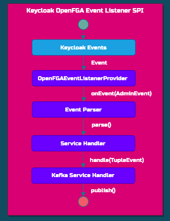

# Keycloak OpenFGA Custom Event Listener for integrating Keycloak and OpenFGA

Here is a Custom Event Listener Extension known as Service Provider Interfaces (SPI) which:
1. listens to the following Keycloak events: User Role Assignment, User Group Assignment, Role to Role Assignment  and User Group Assignment 
2. converts this event into an OpenFGA tuple based on [keycloak-openfga-authorization-model](keycloak-openfga-authorization-model.json) and the following [OpenFGA Authorization Schema](openfga/keycloak-authorization-model.json):
<p align="center">
  
</p>
3. publishes the event to [Kafka](https://kafka.apache.org/) Cluster

## Overview

This custom Keycloak OpenFGA Event Listener is one of the components of the following authorization architecture:


* Core:
    * Keycloak (A) is responsible for handling the authentication with the standard OpenID Connect and is managing the user access with his Role Model
    * Keycloak is configured with a custom extension :rocket: (B) [keycloak-openfga-event-listener](https://github.com/embesozzi/keycloak-openfga-event-listener) which listens to the Keycloak events (User Role Assignment, Role to Role Assignment, etc), parses this event into an OpenFGA tuple based on the [Keycloak Authz Schema](openfga/keycloak-authorization-model.json) and publishes the event to Kafka Cluster (C)
    * Kafka OpenFGA Consumer (D) that using the OpenFGA SDK will publish the tuples to the OpenFGA Solution
    * OpenFGA (E) is responsible for applying fine-grained access control. The OpenFGA service answers authorization checks by determining whether a relationship exists between an object and a user
* Other components
    * Store Web Application is integrated with Keycloak by OpenID Connect
    * Store API is protected by OAuth 2.0 and it utilizes the OpenFGA SDK for FGA

More details are available here:
* Article [Keycloak integration with OpenFGA (based on Zanzibar) for Fine-Grained Authorization at Scale (ReBAC)](https://embesozzi.medium.com/keycloak-integration-with-openfga-based-on-zanzibar-for-fine-grained-authorization-at-scale-d3376de00f9a)
* Workshop: https://github.com/embesozzi/keycloak-openfga-workshop

##  Objective

The goal of this extension is to publish the Keycloak events for [OpenFGA](https://openfga.dev/) which is an open source solution for Fine-Grained Authorization that applies the concept of ReBAC (created by the Auth0 inspired by Zanzibar).
 [Zanzibar](https://research.google/pubs/pub48190/) is "Google's Consistent, Global Authorization System" for "determining whether online users are authorized to access digital objects" across their products, for instance Google Drive as you can see in the following image:


OpenFGA is responsible for applying fine-grained access control in a high performance and flexible authorization / permission system based on Keycloak events.

## How does it work?
The main purpose of this SPI is to listen to the Keycloak events and publish these events to an OpenFGA solution.

Here is a high level overview of the extension:

<p align="center">
  
</p>

In this case, the extension listens to the Admin Events related to operation in Keycloak Identity, Role and Group model. So far, the extension proceeds with the following steps:

1. Parse and enrich the default Keycloak events in the following cases:

| Keycloak Event (Friendly Name) |               Description                  | 
|--------------------------------|:------------------------------------------:|
| User Role Assignment           |    User is assigned to a Keycloak Role     |
| Role To Role Assignment        | Role is assigned to a parent Keycloak Role |
| Group To Role Assignment       |    Group is assigned to a Keycloak Role    |
| User Group Membership          |        User is assigned to a Group         |


2. Transform the Keycloak event into a OpenFGA tuple and check if that is handled by [keycloak-openfga-authorization-model](keycloak-openfga-authorization-model.json):

| Keycloak Event (Friendly Name) |               OpenFGA Tuple Event                |
|--------------------------------|:------------------------------------------------:|
| User Role Assignment           |   User related to the object Role as assignee    |
| Role To Role Assignment        |    Role related to the object Role as parent     |
| Group To Role Assignment       | Group related to the object Role as parent group |
| User Group Membership          |       User related to a Group as assignee        |

This is all the OpenFGA events handled by the provided [keycloak-openfga-authorization-model](keycloak-openfga-authorization-model.json). You can edit the authorization model to handle the desired events.

3. Publish the event to  the Kafka Cluster

So far we don’t have an official Java SDK OpenFGA client to publish the authorization tuples. 
This is why I decided to use an Apache Kafka cluster for publishing the events. Kafka is a messaging system that safely moves data between systems. Depending on how each component is configured, it can act as a transport for real-time events tracking or as a replicated distributed database.
Nevertheless, the extension is prepared for the future to use a http client for publishing the events. I will add the feature to the extension as soon as Auth0 releases a Java OpenFGA SDK.

This version of the extension supports publishing the events to [Kafka](https://kafka.apache.org/).

## How to install?

Download a release (*.jar file) that works with your Keycloak version from the [list of releases](https://github.com/embesozzi/keycloak-openfga-event-listener/releases).
Or you can build with ```bash mvn clean package```

Follow the below instructions depending on your distribution and runtime environment.

### Quarkus-based distro (Keycloak.X)

Copy the jar to the `providers` folder and execute the following command:

```shell
${kc.home.dir}/bin/kc.sh build
```

### Container image (Docker)

For Docker-based setups mount or copy the jar to
- `/opt/keycloak/providers` for Keycloak.X from version `15.1.0`

> ⚠️ **Warning**:
>
> With the release of Keycloak 17 the Quarkus-based distribution is now fully supported by the Keycloak team.
> Therefore, <b>I have not tested this extension in Wildfly-based distro </b> :exclamation: ️

## Module Configuration
The following properties can be set via environment variables following the Keycloak specs, thus each variable MUST use the prefix `KC_SPI_EVENTS_LISTENER_OPENFGA_EVENTS`.


`KC_SPI_EVENTS_LISTENER_OPENFGA_EVENTS_AUTHORIZATION_MODEL`: The `authorizationModel` handled by this module. See [keycloak-openfga-authorization-model](keycloak-openfga-authorization-model.json)

`KC_SPI_EVENTS_LISTENER_OPENFGA_EVENTS_SERVICE_HANDLER_NAME`: The `serviceHandlerName` is the name of the service for publishing the events. This version only supports the value: `KAFKA`

`KC_SPI_EVENTS_LISTENER_OPENFGA_EVENTS_ADMIN_TOPIC` : The `adminTopic` is the name of the kafka topic to where the OpenFGA tuple events will be produced to.

`KC_SPI_EVENTS_LISTENER_OPENFGA_EVENTS_CLIENT_ID`: The `clientId` used to identify the client in Kafka.

`KC_SPI_EVENTS_LISTENER_OPENFGA_EVENTS_BOOTSTRAP_SERVERS`: The `bootstrapServers` is a comma separated list of available brokers.


You may want to check [docker-compose.yml](docker-compose.yml) as an example.

## Keycloak Configuration

### Enable OpenFGA Event listener extension in Keycloak
Enable the Keycloak OpenFGA Event Listener extension in Keycloak:

* Open [administration console](http://keycloak:8081)
* Choose realm
* Realm settings
* Select `Events` tab and add `openfga-events` to Event Listeners.


# Test Cases
The test cases are available in the workshop:

* Workshop: https://github.com/embesozzi/keycloak-openfga-workshop
